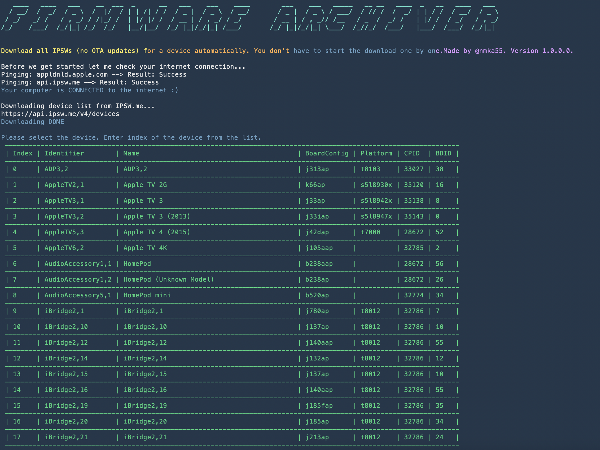

Welcome to Firmware Archiver
===================

Welcome to my quarantine fun project Firmware Archiver. The main and only purpose of this tool is to **download** full restore **IPSWs** from Apple servers **automatically**. You just have to specify your desired device and download location. Tool is based on .NET Core 3.1.0 so it supports Windows, macOS and Linux.

Big thanks to IPSW.me for the API and other developers who created the packages used in this project.
----------
> **Instructions:**

> - Download and install .NET.Core Runtime 3.1.0 for your OS from [Microsoft's Official Page](https://dotnet.microsoft.com/download)
> - Download the release package from [here](https://www.dropbox.com/s/pf4xfxpg77kzrbw/FirmwareArchiver_release1.0.zip?dl=0 "here") and unzip .
> - Open *terminal* or *command prompt* navigate to unzipped release folder (`cd PATHTOFOLDER`) and execute command `dotnet ./FirmwareArchiver.dll`

----------
> **Note:**

> - Tool will only download one IPSW at a time. (Not simultaneously, I think this way it's faster...)
> - There's not much error handling, so if it crashes or exits,  please try again patiently :D

